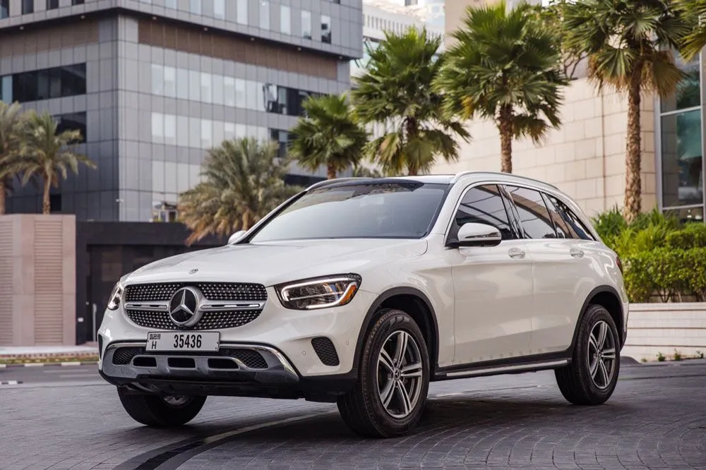

# Uptown Rentals - Mercedes GLC 300 Rental Page

A responsive vehicle rental experience designed to help customers evaluate a car, check its availability, and continue their inquiry through WhatsApp with minimal friction.



## Project Overview

This project is a focused product page for Uptown Rent A Car in Dubai. It presents the Mercedes-Benz GLC 300 as a complete rental experience rather than a static catalogue listing.

The page brings the information and actions a renter needs into one clear journey:

1. Understand the vehicle and daily price.
2. Explore exterior and interior photos.
3. Review rental requirements and vehicle condition.
4. Request availability without selecting the same vehicle again.
5. Send a structured inquiry directly through WhatsApp.

## The Problem

Car rental pages often create unnecessary friction. Important details are scattered across the page, image galleries are difficult to browse, and customers are asked to repeat information when they reach the booking form. Unstructured WhatsApp conversations also require rental teams to ask the same follow-up questions repeatedly.

On smaller screens, these issues become more noticeable when navigation, forms, images, and contact information are not designed as one responsive system.

## The Solution

I designed and built a single-vehicle rental flow around the customer's decision-making process. The Mercedes-Benz GLC 300 remains the active vehicle throughout the experience, so every call to action leads to a relevant, pre-contextualized inquiry.

The WhatsApp flow asks for the renter's name, dates, delivery location, driver status, and main question. It then generates a formatted message and opens WhatsApp with the details already filled in. This gives the customer a faster way to ask for information while giving the rental team a more useful first message.

## Key Features

- Responsive desktop, tablet, and mobile layouts
- Toggleable mobile navigation drawer with backdrop and Escape-key support
- Interactive image gallery with previous/next controls and clickable previews
- Vehicle pricing, specifications, condition, and rental information
- Smooth scrolling from availability calls to action
- Availability form with the Mercedes-Benz GLC 300 already selected
- Frontend success modal with automatic form reset
- Structured WhatsApp inquiry form with a custom-styled dropdown
- Preformatted WhatsApp message generation
- Clickable phone, email, WhatsApp, location, and social links
- Visible focus states, descriptive image text, and accessible control labels

## UX Decisions

### Keep the vehicle context

Customers arrive on a page for a specific car, so the booking flow does not ask them to choose it again. This removes a redundant step and reduces the chance of an incorrect inquiry.

### Support two inquiry paths

The page offers both a standard availability form and WhatsApp. The primary flow is suitable for a direct request, while WhatsApp supports customers who want answers before committing.

### Structure the first WhatsApp message

Instead of opening an empty conversation, the WhatsApp form captures common rental questions first. The resulting message includes the selected car and any details supplied by the renter.

### Design mobile behavior intentionally

The layout reorganizes into a single-column experience, navigation becomes a toggleable sidebar, controls expand for easier tapping, and footer content is centered for smaller screens.

## Technology

- Semantic HTML5
- Modern CSS with custom properties, Grid, Flexbox, and responsive media queries
- Vanilla JavaScript for gallery state, modals, navigation, form handling, and WhatsApp message generation
- Font Awesome for interface and contact icons
- Google Fonts for the visual identity

No framework or build step is required.

## Project Structure

```text
uptown-rentals-demo/
|-- assets/        # Logo, vehicle cutout, and gallery photography
|-- index.html     # Page structure and content
|-- style.css      # Visual system and responsive layouts
|-- script.js      # Interactions and form behavior
`-- README.md
```

## Run Locally

Clone the repository and open `index.html` in a browser, or serve it locally:

```bash
python3 -m http.server 8000
```

Then visit `http://localhost:8000`.

An internet connection is needed for the externally hosted fonts and Font Awesome icons.

## Demo Scope

This is a frontend prototype. The availability form demonstrates the complete customer interaction and success state, but it does not send data to a backend. The WhatsApp flow is functional and opens a prefilled conversation using a `wa.me` link.

For production, the next steps would be server-side form handling, date and fleet availability validation, analytics, automated confirmation messages, and integration with a rental management system.

## What This Project Demonstrates

- Translating business requirements into a focused customer journey
- Designing conversion-oriented interfaces without overloading the page
- Building responsive behavior across navigation, media, forms, and footers
- Creating useful interactions with framework-free JavaScript
- Treating WhatsApp as a structured product flow instead of a generic outbound link

